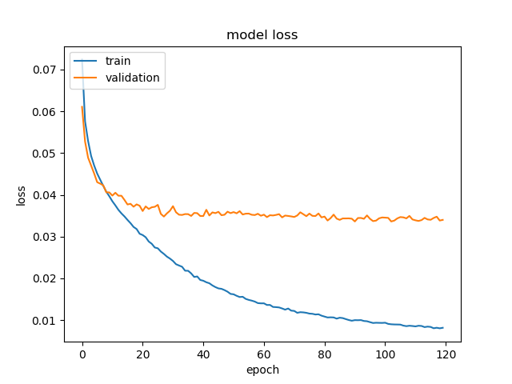

# **Behavioral Cloning Report**

The goals of this project are:
* To build a model to drive the [Self-Driving Car Simulator](https://github.com/udacity/self-driving-car-sim);
* To define and obtain the appropriate dataset to train the driver model;
* To evaluate the proposed solution on simulator.

### Pipeline
The goal is to predict the steering angle in [Self-Driving Car Simulator](https://github.com/udacity/self-driving-car-sim). To perform this task, the driver must know the car situation on the road. In fact, the simulator captures and sends information to the controller. It has acccess to:
* current speed;
* current throttle;
* current steering angle;
* current images of the road taken from 3 cameras inside the Car.

The controller is a program that uses these data to compute throttle and steering angle. It sends data to the simulator that updates its state. The continuous execution as the following:

**Receive State** Car --> **Predict** throttle and steering --> **Send control** message to simulator

that repeats the previous steps continuously.

The crucial task is to **predict** and, to achieve it, we have trained a **Deep Learning Model**. As we known, **Machine Learning** tries to *learn* how to perform a task from a lot of data that shows the expected behavior. To accomplish this, we have drove the simulator in **training mode** capturing relevant information (camera images and steering angle). The idea is that the model could mimic the behavior given by examples.

### Model Architecture

At a rate of 15 Hz in training mode, the simulator could give us the following information:

* Image from center camera. This image focus on the road and is 320 pixels wide per 160 pixels height with 24 bits colorful depth per pixel. A typical image is like:


* Images from left and right camera;
* current speed, throttle and steering angle.

**The proposed model uses only the center image** and tries to predict the steering angle as the diagram:


We have used [keras](https://keras.io/) to define the model. Following table shows each layer:


Layer (type) | Kernel | Filters | Stride | Output Shape | Param #   
-------------|--------|---------|--------|--------------|--------
image (InputLayer) | | | | (160, 320, 3) | 0
lambda_1 (Lambda) | | | | (160, 320, 3) | 0
conv_1 (Conv2D) | (10,10) | 24 | | (160, 320, 24) | 7224
relu_1 (Activation) | | | | (160, 320, 24) | 0
maxpool_1 (MaxPooling2D) | (3, 6) | | (2, 6) | (79, 53, 24) | 0
conv_2 (Conv2D) | (7,7) | 36 | | (79, 53, 36) | 42372
relu_2 (Activation) | | | | (79, 53, 36) | 0
maxpool_2 (MaxPooling2D) | (3, 6) | | (2, 6) | (39, 8, 36) | 0
conv_3 (Conv2D) | (5,5) | 48 | | (39, 8, 48) | 43248
relu_3 (Activation) | | | | (39, 8, 48) | 0
maxpool_3 (MaxPooling2D) | (3, 3) | | (2, 2) | (19, 3, 48) | 0
flatten_1 (Flatten) | | | | (2736) | 0
fc1 (Dense) | | | | (512) | 1401344
activation_1 (Activation) | | | | (512) | 0
dropout_fc1 (Dropout) | | | | (512) | 0
fc3 (Dense) | | | | (16) | 8208
predict_steer (Dense) | | | | (1) | 17

Total params: **1,502,413**

### Dataset
To train the model there should be a directory **data** with file **driving_log.csv** and **IMG** folder. The **driving_log.csv** must have the following columns data separated by comma (,):

* filename center image;
* filename right image;
* filename left image;
* steering angle;
* acceleration;
* break;
* speed;

We are using only center image and steering angle data, then it is OK to have fake data in filename right, left image, acceleration, brake and speed. [Dataset file](https://s3-us-west-1.amazonaws.com/carnd-dataset-hohne/dataset_carnd_behavioral_cloning.zip) has the data used to obtain the trained [model.h5](model.h5). It has datapoints from 5 sources:

* dataset provided by Udacity that contains data captured driving on track 1 (~ 8k datapoints);
* when driving on track 1 trying to keep at the center of the lane (~ 2k datapoints);
* when driving on track 1 while trying to recover to the center of the lane (~ 2k datapoints);
* when driving on track 2 trying to keep at the center of the lane (~ 8k datapoints);
* when driving on track 2 while trying to recover to the center of the lane (~ 2k datapoints).

### Training Procedure

First, script **model.py** tries to load the dataset, if it can not find it, then it is downloaded from Internet. After, dataset is splitted in:

* training dataset (70% of whole dataset);
* validation dataset (10%);
* test dataset (20%).

After, ckeck if a pre-trained model exists (file [model.h5](model.h5)), if this is true, load the file model. If there is not a previous model.h5 file, build a fresh model from **buildModel** function.

Next step, starts to teach the model calling the **get_data_generador** to provide data for each minibatch. We have choose [stochastic gradient descent](https://en.wikipedia.org/wiki/Stochastic_gradient_descent) with hyperparameters:

* **learning rate**: 0.0075;
* **decay**: 1e-6;
* **momentum**: 0.9;
* **nesterov**;
* **epochs** 120;

To train, execute:

```
del model.h5
python model.py
```

At the end, python script generates image **train_history.png** similar to:



Loss in test dataset was **0.035**. As it is clear the model is overfitting, we have tried use **Dropout** to fight it but was not able to decreased completely.

### Autonomous Driving

Now it is time to test the pipeline in Simulator. To accomplish this task, we should start the simulator in **Autonomous Mode** on track 1 then in a terminal execute drive.py script as:

```
python drive.py model.h5
```

This command will try to control the simulator at speed 30. The result video could be seen in:

[](video_track_1.mp4)

This video shows only the first lap, but the model is able to drive longer (at least 30 minutes).

To try something more challenging, choose track 2 and run the drive.py as:

```
python drive.py model.h5 25
```

We have modified the original **drive.py** script to allow changing the desired speed, in this case to 25. The recorded video is:

[](video_track_2.mp4)

The final challenge task is to drive on track 2 at full speed (30) as:

```
python drive.py model.h5
```

The result in video:

[](video_track_3.mp4)

At full speed, we can see that driving is dangerous and, the car will eventually, crash.
